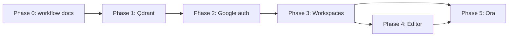

# DocsChat Evolution — Implementation Plan

> **Goal**: Evolve the existing DocsChat (FastAPI + Next.js + MongoDB + ChromaDB) into a multi-workspace AI platform with OAuth, persistent vector search, a document editor, and an AI assistant — all built on top of the current codebase.

---

## How to use this plan (read first)

This document is a **compass, not a script**. It captures intent, order of work, and known pitfalls. It is **not** 100% accurate against the live codebase, vendor APIs, or free-tier limits — and it will drift as we build.

**Do not follow this plan blindly.** While implementing:

1. **Read the actual code** in this repo before changing it. File lists, function signatures, and line counts in this plan can be stale.
2. **Research current docs** for Qdrant, Google Identity Services, Google embeddings, FastAPI, Next.js, Tiptap, and any library you add. Prefer official docs and the library version that is actually installed over examples copied from this file.
3. **If the plan conflicts with reality, reality wins.** Wrong dimension, deprecated API, missing authz, a better data model — stop, choose the sound engineering option, and note the deviation in the PR.
4. **If a step is technically impossible, missing a dependency, or would ship a security hole, do not implement it as written.** Notify the user, then continue with a better approach.
5. **File-by-file tables are hints**, not a closed set. You may create, skip, or rename files when that is cleaner. You may touch files this plan forgot (for example landing-page `/register` links, `render.yaml`, `api.ts`).
6. **Estimated effort is a guess.** Phase 3 is larger than “moderate.” Adjust scope rather than rushing a broken cutover.

### Research protocol (every phase)

Before writing code for a phase, spend a short research pass:

| Check | Why |
|-------|-----|
| Current library API for the version in `requirements.txt` / `package.json` | This plan may cite older names (`SearchRequest`, embedding model ids, GIS setup) |
| Actual embedding vector size from a live `embed_query` (or documented `output_dimensionality`) | Do not hardcode 768 |
| Qdrant Cloud free-tier limits (RAM, collections) | Collection-per-workspace may be a bad fit |
| Google Cloud OAuth: JS origins **and** redirect URIs for your exact GIS flow | Console setup in this plan is incomplete |
| Existing callers of any API you rename | Frontend hooks/components are hardcoded today |

After research, implement the **goal** of the phase. Deviating from a table row is expected. Quietly shipping a known-bad design is not.

### Implementer rules (also belongs in `AGENTS.md`)

- Fulfill the **core goal** of the phase, not the exact diff list.
- Think independently. If a well-known pattern (payload filters, nested FastAPI routers with a shared ownership dependency, debounce + content-hash reindex) is better than the plan, use it.
- Stop and tell the user when you hit a major blocker (auth lockout, data loss, quota, breaking production with no migration).
- Never hardcode secrets. Never push to `main`. Never delete user data without an explicit migration path.
- Do not change existing API shapes without a coordinated frontend change **or** a documented compatibility window.

---

## Current Codebase Summary

Verify this against the tree; it is a snapshot.

| Layer | Stack | Key Files |
|-------|-------|-----------|
| Frontend | Next.js 16, Tailwind v4, TypeScript | pages: `/`, `/login`, `/register`, `/notebook`; hooks: `useAuth`, `useChat`; `lib/api.ts` (get/post/delete only — **no put**) |
| Backend | FastAPI, Python (Render uses 3.12 in `render.yaml`) | 3 route files, services including `vector_store.py`, `rag_service.py`, `auth_service.py` |
| Database | MongoDB Atlas | `users`, `sources`, `messages` |
| Vector Store | ChromaDB; **in-memory on Render** (`CHROMA_PERSISTENT=false`) | `backend/app/services/vector_store.py` |
| Embeddings | `GOOGLE_EMBEDDING_MODEL` in `config.py` (currently `models/gemini-embedding-2`, **not** text-embedding-004) | `embedding_service.py` |
| Auth | JWT + bcrypt email/password | `POST /api/auth/register`, `POST /api/auth/login`, `GET /api/auth/me` |

Known production gaps this plan only partly addresses:

- Vectors reset on Render restart (Phase 1).
- Uploaded PDFs live on the Render disk (`uploads/`) and are **also** ephemeral. Qdrant does not fix file storage. Call that out; object storage is a later decision, not a silent assumption.

---

## Implementation Phases

### Phase 0: AI Workflow Setup

**Why**: Shared instructions so later work is consistent. Keep this **short**. Do not delay Phase 1 (the data-loss fix) for perfect agent docs.

**Do not overwrite** existing `frontend/AGENTS.md` / `frontend/CLAUDE.md` (Next.js stubs) unless you are intentionally extending them.

#### Suggested files

| File | Purpose |
|------|---------|
| `AGENTS.md` (project root) | Project context, stack, run/lint/test, folder map, coding rules, implementer “do not follow plans blindly” rules |
| `CLAUDE.md` / `GEMINI.md` (root) | Pointers to `AGENTS.md` |
| `.agents/skills/add-feature/SKILL.md` | Research → implement goal → small commits → tests → PR |
| `.agents/skills/write-tests/SKILL.md` | pytest / frontend tests **if those tools exist**; add flake8/pytest to backend deps before making them a gate |
| `.agents/skills/review-changes/SKILL.md` | Security, authz, leftover TODOs, “did we follow the plan blindly?” |
| `.agents/skills/open-pull-request/SKILL.md` | Branch naming, commit style |

If flake8 is not in `requirements.txt`, either add it or do not claim “flake8 must pass” until it is installed.

#### Subagent roles

| Role | Responsibility |
|------|----------------|
| **Planner** | Read code + current docs, produce a short plan. Does not write feature code. |
| **Implementer** | Ship the phase goal. Research APIs. Deviate when the written plan is wrong. Stop on major blockers. |
| **Reviewer** | Audit against **goals, security, and the live code**, not checkbox compliance with this markdown file. |

#### Definition of Done (any phase)

1. The **user-facing goal** works (even if the approach differs from this document).
2. Lint for the stacks you actually configured.
3. No secrets hardcoded.
4. API breaks are either avoided or shipped together with frontend + a migration note.
5. PR (or commit message) lists **intentional deviations** from this plan and why.

---

### Phase 1: ChromaDB → Qdrant

**Why first**: Fixes vector loss on Render restart. Later features need a durable store.

**Goal**: Embeddings persist across API restarts; upload / query / delete still work through the same RAG flow.

**Effort**: Small-to-medium. Not “swap one file” if dimensions, IDs, and filters need care.

#### 1.1 Manual: Qdrant Cloud

- Create a cluster; store URL + API key in env (local `.env` **you** edit; `render.yaml` + `.env.example` in git).
- Re-check free-tier limits at implementation time. Do not assume 1GB / unlimited collections.

#### 1.2 Design decision (research, then choose)

This plan previously suggested one Qdrant collection per user, then per workspace. **That may be wrong** on a small Cloud cluster (collection RAM overhead).

**Preferred default unless research says otherwise:**

- One collection (or one per environment), named stably.
- Payload on every point: `user_id`, later `workspace_id`, `source_id`, `source_type` (`pdf` | `document`), plus existing chunk metadata.
- Filter on payload for query/delete.

If you keep per-user collections, document why (isolation vs cost). Do **not** create a collection per workspace without checking quota.

#### 1.3 Backend (suggested touch list — not exclusive)

| Area | Intent |
|------|--------|
| `requirements.txt` | Replace chromadb with current `qdrant-client`; pin a version you verified in docs |
| `config.py` | `QDRANT_URL`, `QDRANT_API_KEY`; remove unused Chroma flags |
| `vector_store.py` | Same **callers** (`add_documents`, `query_documents`, `delete_source_vectors`, `get_or_create_collection` / equivalent, `get_collection_count`). Internals are Qdrant. |
| `.env.example`, `render.yaml` | New env vars; drop `CHROMA_PERSISTENT` |
| README architecture | Chroma → Qdrant |

**Implementation notes (verify against current Qdrant client docs):**

- Point IDs must be UUID or unsigned int. Today Chroma IDs are strings like `chunk_{uuid}` — adapt.
- Vector size: measure from `generate_single_embedding` (or set embedding `output_dimensionality` explicitly and match Qdrant). **Do not hardcode 768** unless that is the measured size.
- Use the **current** client methods (`upsert`, `query_points` / documented search API). Ignore outdated `SearchRequest` snippets in this file if the SDK moved on.
- Similarity: Chroma used `1 - distance`. Map Qdrant scores honestly (cosine vs euclid) so citations are not nonsense.
- Existing Render vectors cannot be migrated; they are already gone. Users re-upload PDFs. Say so in the PR.

Public function names may change if you improve the module — then update `rag_service.py` / `sources.py` in the same PR. Stability of **behavior** matters more than freezing names forever.

#### 1.4 Test the goal

- Upload a PDF; points appear in Qdrant.
- Restart the API; query still returns chunks.
- Citations still resolve via `sources_collection`.
- Delete source; points with that `source_id` (and `user_id`) are gone.

---

### Phase 2: Google-only auth

**Why**: Simpler login. Independent of Qdrant **code**, but do not debug auth and vectors in the same release if you can avoid it.

**Goal**: “Continue with Google” verifies an ID token, upserts a user by email, returns the same JWT + `TokenResponse` shape the frontend already stores.

**Do not** delete email/password until Google login works in production **or** you have an explicit cutover (this may be a tiny user base — write that decision down).

#### 2.1 Manual: Google Cloud Console

Research the **exact** GIS / `@react-oauth/google` flow you pick. Typically you need:

- OAuth client (Web)
- Authorized JavaScript origins: localhost + production frontend
- Authorized redirect URIs as required by that library version
- `GOOGLE_CLIENT_ID` in backend **and** `NEXT_PUBLIC_GOOGLE_CLIENT_ID` on Vercel
- Add `GOOGLE_CLIENT_ID` to **Render** env, not only `.env.example`

#### 2.2 Backend intent

- `POST /api/auth/google` with `{ "credential": "<id_token>" }`.
- Verify with current `google.auth` / `google-auth` APIs (`verify_oauth2_token` or documented equivalent). Audience = client ID.
- Find-or-create by email. Set `auth_provider`, `picture`, `username` from Google profile.
- Keep `create_access_token` / `decode_access_token` / `GET /api/auth/me`.
- Update `UserResponse` only if the frontend needs `picture`; keep token response compatible.

**Existing password users:** same email → Google sign-in should log into that account (merge). Different email → they cannot sign in. Call that out. Removing `bcrypt`/`passlib` is optional after cutover, not a trophy.

#### 2.3 Frontend intent

- Google button on `/login` (and treat “sign up” as the same button).
- Remove or redirect `/register`.
- **Hunt all `/register` links** (`Nav.tsx`, `Hero.tsx`, `CTA.tsx`, `page.tsx`) — this plan’s file table will miss some.
- Keep JWT in `auth.ts`; `/notebook` after success.

#### 2.4 Test the goal

- First Google sign-in creates a user.
- Second sign-in same account does not duplicate.
- Refresh still authenticated.
- Logout works.
- Old password login: either still works during dual-run, or is intentionally gone with a note.

---

### Phase 3: Multi-workspace

**Why**: Editor and Ora need a scope. This is the **largest** breaking change. Treat it as large.

**Goal**: A user has many workspaces; sources, chat, and later documents are isolated per workspace; **only the owner** can access a workspace.

#### 3.1 Data model (starting point — adjust if Mongo usage suggests otherwise)

`workspaces`: `user_id`, `name`, `description`, timestamps.

Add `workspace_id` to `sources` and `messages`. Indexes: `(user_id, workspace_id)` (and whatever query patterns you actually use).

#### 3.2 Vectors

Do **not** blindly rename collections to `ws_{id}`. Extend Phase 1 payload with `workspace_id` and filter. Research again if Qdrant limits changed.

#### 3.3 Security (non-negotiable)

Every nested route must:

1. Load workspace by id.
2. Assert `workspace.user_id == current_user.id` (404 if not — no leaking existence if you prefer).
3. Then query child resources **and** filter by `workspace_id`.

A shared FastAPI dependency is better than copy-paste. If this plan’s route table forgot that, add it anyway.

#### 3.4 API change strategy

A full path rewrite (`/api/workspaces/{ws_id}/sources`, `.../chat/...`) is cleaner long-term but **breaks** `SourcesSidebar`, `UploadArea`, `useChat` (paths without `/api` prefix in client because `API_BASE_URL` already includes `/api`).

**Pick one and ship it atomically:**

- **A (preferred for a small app):** one release — new routes + all frontend callers + redirect `/notebook` → `/notebook/{defaultWorkspaceId}`.
- **B:** keep old user-scoped routes as aliases of the default workspace during a short window.

Do not leave `/notebook` as a dead page.

Cascade on workspace delete: Mongo children, disk files if present, Qdrant points for that workspace. Research Motor transactions vs sequential deletes; be consistent.

#### 3.5 Migration

- Script or first-request hook: create “Default Workspace”, backfill `workspace_id` on existing sources/messages.
- Idempotent. Safe to re-run.

#### 3.6 Frontend

Workspace switcher, `useWorkspaces`, dynamic route. `api.ts` will need whatever methods the new UI uses.

#### 3.7 Test the goal

- User A cannot read User B’s workspace id.
- Chat and PDFs stay inside the selected workspace.
- Delete workspace removes its data.
- Old users get a default workspace and still see prior PDFs/chat.

---

### Phase 4: Document editor (Notion-like)

**Depends on** workspaces.

**Goal**: Rich-text docs in a workspace, saved in Mongo, optionally searchable by RAG without melting embedding quota.

#### 4.1 Model (starting point)

`documents`: `user_id`, `workspace_id`, `title`, `content` (editor HTML/JSON — **choose Tiptap’s real storage format from current Tiptap docs**, not necessarily “HTML string”), `plain_text`, timestamps, optional index status.

#### 4.2 API

CRUD under the workspace. Same ownership dependency as Phase 3.

`frontend/src/lib/api.ts` currently has get/post/delete only. Add `put`/`patch` **or** use `request()` consistently — this plan was wrong to say api.ts needs no change.

#### 4.3 Indexing (do not follow the naive “reindex on every PUT”)

A 2s debounce that delete+re-embed on every keystroke burst will race and burn Google quota.

**Sensible default:**

- Auto-save document body to Mongo on debounce (cheap).
- Reindex to Qdrant when content hash changes **and** (explicit “Update index” **or** a longer idle, e.g. 10–30s, **or** on blur). Skip if text unchanged.
- Payload: `source_type=document`, `source_id=document_id`, `workspace_id`, `user_id`.
- **Update `_resolve_citations`** so document hits show the document title, not “Unknown source”. The current helper only reads `sources_collection`.

Tiptap: research current `@tiptap/react` + starter-kit for Next.js App Router / React 19. Extensions listed here are a starting set, not a bill of materials.

#### 4.4 Test the goal

- Create/edit/delete docs.
- Ask in chat/Ora: answers can cite the doc.
- Rapid typing does not fire dozens of embedding calls.
- Another user cannot fetch the doc by id.

---

### Phase 5: AI assistant (Ora)

**Goal**: Same RAG chat, workspace-scoped, reachable from workspace pages as a slide-over. Persona rename is optional.

**Not in MVP:** Vapi/voice, cross-workspace search (that undoes Phase 3 isolation). Do not add `/api/ora/ask` unless you need a public alias — reuse `/chat/ask`.

Reuse streaming logic in `useChat` / `ChatPanel`; do not fork a second SSE client unless necessary.

---

## Phase order

- Phase 0 must not block Phase 1.
- Do **not** parallelize Phase 2 and Phase 3: both touch first-login, `database.py`, and `main.py`. Serial is cheaper than merge pain.
- After each phase, re-read this document and the code; drop or rewrite steps that are now obsolete.

---

## Free-tier services (re-verify when you implement)

| Service | Assumed free tier | Used for |
|---------|-------------------|----------|
| Qdrant Cloud | Check current limits | Vectors |
| MongoDB Atlas | 512MB class | App data |
| Google AI Studio | Free API key / quotas | LLM + embeddings |
| Groq | Rate-limited | Alternate LLM |
| Google Cloud OAuth | Free | Sign-in |
| Render / Vercel | Current free plans | API / frontend |

Quotas change. If a choice in this plan exceeds the tier you actually have, pick a cheaper design (single Qdrant collection, fewer reindexes, etc.).

---

## How to work a phase

1. Branch, e.g. `feature/phase-1-qdrant`.
2. **Research + read code** (see protocol above).
3. Implement the **goal**. Skip or replace flawed steps.
4. Record deviations in the PR.
5. Test the phase checklist (adapt it if you changed the design).
6. Do not merge to `main` without review.

When prompting an agent: paste **this “How to use this plan” section plus one phase**. Instruct it that the phase tables are suggestions and that official docs + the repository override this file.
